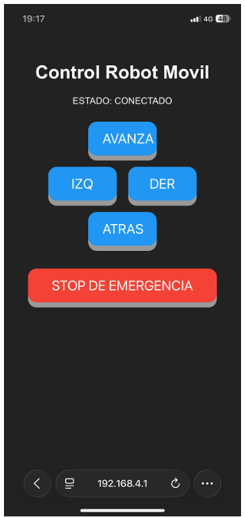

# Proyecto Robot de Tracción Diferencial

---

## Descripción del Proyecto
Este repositorio contiene el conjunto de software y firmware desarrollado para el diseño, control y navegación de un robot móvil de tracción diferencial, haciendo uso del microcontrolador **ESP32**. El proyecto se estructura en diferentes tareas, que van incrementando en dificultad, abarcando desde el modelado cinemático básico en bucle abierto hasta la integración en entornos distribuidos **ROS 2** mediante **micro-ROS** y el control mediante servidor web.

---

## Arquitectura de Hardware y Conexionado

El sistema se compone de un microcontrolador ESP32, que se encarga de enviar las señales PWM de entrada a un driver L298N, que actúa como etapa de potencia, convirtiendo estas señales de bajo nivel en señales capaces de suministrar la corriente y tensión necesarias a los dos motores. Estos motores conforman el chasis diferencial, además, cada motor lleva un encoder acoplado a su eje. Cada encoder genera dos señales en cuadratura, que se utilizan para contar los pulsos generados durante la rotación del eje de cada motor. Además, se requiere de una fuente de alimentación, en este caso, 2 pilas de litio INR 18650 30Q 3000mAh.

### Conexiones del Sistema 
### Tabla 2.1: Conexiones del sistema por motor

| Conexión | Motor 1 (Señal) | Motor 1 (Pin ESP32 / Cable) | Motor 2 (Señal) | Motor 2 (Pin ESP32 / Cable) |
| :--- | :---: | :---: | :---: | :---: |
| **Driver-ESP32** | IN1 | PIN 32 | IN3 | PIN 27 |
| | IN2 | PIN 33 | IN4 | PIN 14 |
| **Driver-Motor** | OUT1 | Blanco | OUT3 | Rojo |
| | OUT2 | Rojo | OUT4 | Blanco |
| **Encoder-ESP32** | Amarillo | PIN 26 | Amarillo | PIN 4 |
| | Verde | PIN 25 | Verde | PIN 13 |

---

### Tabla 2.2: Conexiones comunes

| Tipo | Origen | Destino |
| :--- | :--- | :--- |
| **Alimentación** | UPS+ alimentación | 12 V driver |
| | UPS- alimentación | GND ESP32 |
| **Tierra común** | GND ESP32 + GND encoders | GND drivers |

---

### Tabla 2.3: Asignación de pines del ESP32 según el sensor

| Posición Sensor | Izquierda | Centro | Derecha |
| :--- | :---: | :---: | :---: |
| **Out (Echo)** | PIN 39 | PIN 35 | PIN 34 |

---

## Fundamentos Teóricos y Modelo Cinemático

Para la traslación de comandos del mundo físico al plano discreto del microcontrolador se adoptan los siguientes parámetros físicos base:
* **Radio de la rueda ($R$):** $0.0325 \text{ m}$
* **Distancia entre ruedas ($L$):** $0.197 \text{ m}$
* **Resolución del Encoder ($N$):** $1680 \text{ pulsos/vuelta}$

### Cinemática Inversa Diferencial
A partir de las velocidades deseadas de la plataforma (lineal $v$ y angular $\omega$), se determinan las consignas individuales de cada rueda:

$$v_{izq} = v - \frac{\omega \cdot L}{2}$$

$$v_{der} = v + \frac{\omega \cdot L}{2}$$

### Odometría y Estimación de Pose
En cada periodo de muestreo ($T_s = 10\text{ ms}$), se evalúa la variación discreta de pulsos de los encoders ($\Delta \text{counts}$). El desplazamiento lineal diferencial ($\Delta s$) e integración de la pose se calculan mediante aproximación de Runge-Kutta de orden inferior:

$$\Delta s_i = \frac{2\pi R \cdot \Delta \text{counts}_i}{N} \quad (i = L, R)$$

$$\Delta s = \frac{\Delta s_R + \Delta s_L}{2}, \quad \Delta \theta = \frac{\Delta s_R - \Delta s_L}{L}$$

$$x_{k+1} = x_k + \Delta s \cdot \cos\left(\theta_k + \frac{\Delta \theta}{2}\right)$$

$$y_{k+1} = y_k + \Delta s \cdot \sin\left(\theta_k + \frac{\Delta \theta}{2}\right)$$

$$\theta_{k+1} = \theta_k + \Delta \theta$$

---

## Estructura de Tareas y Desarrollo del Software

El repositorio está organizado siguiendo la evolución de tareas del proyecto:

### [Tarea 1](./firmware/tarea1) & [Tarea 3](./firmware/tarea3): Control en Bucle Abierto y Temporización
* **Objetivo 1:** Movimiento rectilíneo uniforme a $0.1\text{ m/s}$ durante $20\text{ s}$ ($2.0\text{ m}$ teóricos).
* **Objetivo 3:** Trayectoria circular de radio $R_{giro} = 0.4\text{ m}$ a velocidad angular $\omega = \frac{2\pi}{10}\text{ rad/s}$ durante $10\text{ s}$.
* **Estrategia:** Uso de constantes de calibración estimadas de forma empírica(`K_OPEN_LOOP = 2200.0`). Control de estados mediante ventanas temporales estrictas con `millis()`.

### [Tarea 2](./firmware/tarea2): Odometría Lineal y Frenado Activo
* **Objetivo:** Recorrer exactamente $2\text{ metros}$ lineales interrumpiendo el bucle por distancia acumulada y no por tiempo.
* **Mitigación de Inercia:** Debido al deslizamiento inherente del lazo abierto, se implementan dos técnicas avanzadas:
  1. *Compensación de Umbral:* Parada a los $1.75\text{ m}$ (absorbiendo $25\text{ cm}$ de inercia).
  2. *Contramarcha Activa:* Inversión instantánea de polaridad (`PWM = -400`) durante un pulso crítico de $50\text{ ms}$ para conseguir establecer el robot en el punto objetivo.

### [Tarea 4](./firmware/tarea4): Lazo Cerrado de Velocidad y Orientación
* **Control de Orientación:** Se almacena el ángulo inicial $\theta_{ref}$. Un controlador Proporcional ($K_{p\_orientacion} = 2.2$) regula el error angular normalizado entre $[-\pi, \pi]$ para corregir desviaciones transversales en tiempo real.
* **Control de Velocidad:** Implementación de **PID** discreto de bajo nivel de cuentas por segundo ($K_p = 0.17$, $K_i = 2.0$, $K_d = 0.005$) con frenado suavizado predictivo (`PWM = -350` por $40\text{ ms}$).

### [Tarea 5](./firmware/tarea5): Guiado Autónomo "Follow the Carrot"
* **Lógica de Control:** Navegación por un array de puntos que definen un perfil cuadrado de $0.5 \times 0.5\text{ m}$.
* **Máquina de Estados Cinemática:**
  * **Giro Puro:** Si el error angular $|e_\theta| > 0.2\text{ rad}$, el robot se detiene en traslación ($v=0$) y ejecuta rotación pura sobre su eje a $\pm 2.0\text{ rad/s}$.
  * **Avance con Corrección:** Cuando se alinea, avanza a $0.20\text{ m/s}$ aplicando correcciones cinemáticas suaves hacia el objetivo.
* **PID Robusto:** Incorporación de **filtro derivativo de primer orden** y algoritmos **anti-windup** en las integrales de velocidad para anular picos de sobrecorriente y saturación ante transitorios bruscos.

### [Tarea 6](./firmware/tarea6): Concurrencia y Seguridad Reactiva
* **Lectura:** Muestreo analógico de los 3 sensores infrarrojos buscando umbrales críticos de tensión ajustados por calibración (`UMBRAL_OBSTACULO = 300`).
* **Rutina de Emergencia:** Ante detección de  obstáculo, se inhiben las consignas de guiado, forzando de inmediato $(v=0, \omega=0)$ y activando la flag `pausa_obstaculo`. Al desaparecer el obstáculo, el sistema ejecuta un estado de retardo de seguridad de $3\text{ segundos}$ mediante temporizadores antes de reanudar la marcha.

### [Tarea 7](./firmware/tarea7): Micro-ROS y ROS 2
* **Infraestructura:** Conexión inalámbrica UDP a través de la pila Wi-Fi nativa del ESP32 hacia un agente local (`IP 172.20.10.4`).
* **Grafo de ROS 2:**
  * **Suscriptor:** Canalizado al topic `/cmd_vel` (`geometry_msgs/msg/Twist`) para la captura dinámica de comandos cinemáticos de teleoperación o planificadores de alto nivel.
  * **Publicador:** Canalizado al topic `/turtlebot_pose` (`geometry_msgs/msg/Pose2D`) inyectando la telemetría de odometría discretizada a frecuencias estrictas de $100\text{ Hz}$ ($T_s = 10\text{ ms}$).

### [Tarea Opcional](./firmware/tareaOpcional): Estación de Control Embebida Web
* **Arquitectura:** Configuración del ESP32 en modo Punto de Acceso (AP) bajo el SSID `"labrob"` levantando un servidor web HTTP autónomo sin dependencias externas.
* **Lógica Asíncrona:** Rutas asíncronas de bajo impacto HTTP GET (`/F`, `/B`, `/L`, `/R`, `/S`) asociadas a botones de la interfaz móvil para control en tiempo real e inclusión de un botón de **STOP DE EMERGENCIA**.
* **Perfil de Rampa:** Para proteger la mecánica ante transitorios bruscos de par, se filtra la consigna objetivo mediante una rampa exponencial:
  
  $$v_{actual} = v_{actual} \cdot (1 - \alpha) + v_{target} \cdot \alpha \quad (\alpha = 0.05)$$

---

## Interfaz de Usuario Remota

<p align="center">
  
  <br>
  <i>Servidor web con punto de acceso local, con control de dirección y parada de emergencia en tiempo real.</i>
</p>

---

## Requisitos e Instalación

1. **Instalación de Dependencias en Arduino IDE / VS Code:**
   * Soporte de tarjetas ESP32 de Expressif.
   * Librería `micro_ros_arduino` (para la compilación de la Tarea 7).
2. **Despliegue del Agente micro-ROS (PC con ROS 2 Humble/Iron):**
   ```bash
   ros2 run micro_ros_agent micro_ros_agent udp4 --port 8888